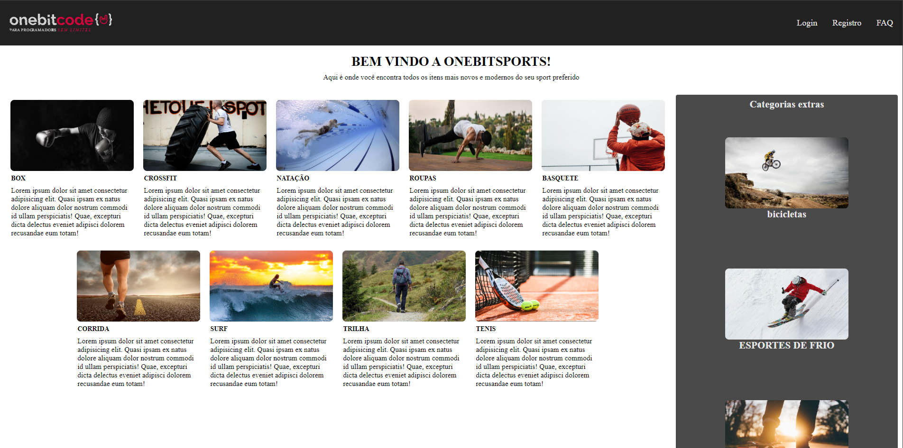
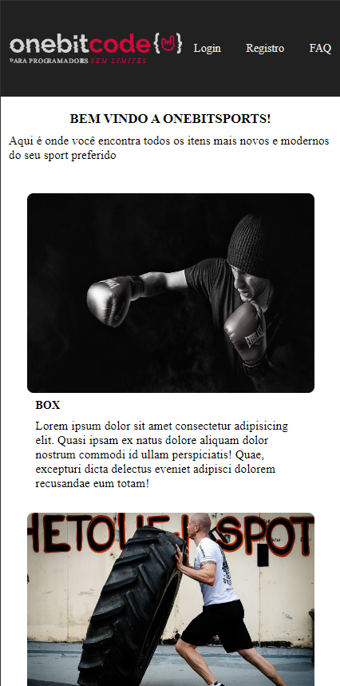
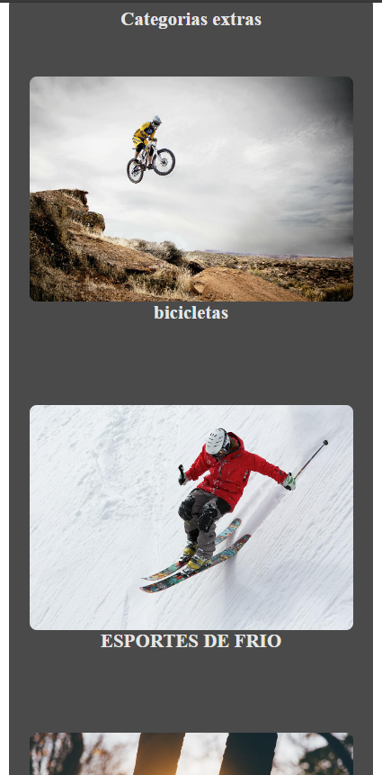

# Estudo de CSS

Este projeto é um estudo sobre CSS, onde exploramos diversos elementos e técnicas para estilizar páginas web de forma eficaz.

## Elementos do CSS Utilizados

Durante o desenvolvimento deste projeto, foram utilizados os seguintes elementos e propriedades do CSS:

### 1. Seletores
- **Seletores de classe**: Utilizados para aplicar estilos a elementos com uma classe específica.
- **Seletores de ID**: Aplicados a elementos únicos na página.
- **Seletores de atributo**: Para estilizar elementos com base em seus atributos.

### 2. Propriedades de Estilo
- **Cores**: Utilização de `color`, `background-color`, e `opacity` para definir cores de texto e fundo.
- **Tipografia**: Propriedades como `font-family`, `font-size`, `font-weight`, e `line-height` para estilizar textos.
- **Espaçamento**: Uso de `margin` e `padding` para controlar o espaço ao redor dos elementos.

### 3. Layout
- **Flexbox**: Implementação de `display: flex` para criar layouts responsivos e alinhamentos dinâmicos.
- **Grid**: Uso de `display: grid` para criar layouts de grade complexos.
- **Posicionamento**: Propriedades como `position`, `top`, `right`, `bottom`, e `left` para controlar a posição dos elementos.

### 4. Efeitos e Transições
- **Sombreamento**: Uso de `box-shadow` para adicionar profundidade aos elementos.
- **Transições**: Implementação de `transition` para suavizar mudanças de estilo.
- **Transformações**: Uso de `transform` para aplicar rotações, escalas e translações.

### 5. Media Queries
- Utilização de media queries para garantir que o design seja responsivo e se adapte a diferentes tamanhos de tela.

## Imagens do Projeto

Aqui estão algumas imagens que demonstram o layout do projeto em diferentes dispositivos:

### Home Desktop


### Home Mobile 1


### Home Mobile 2


## Como Executar o Projeto

Para visualizar o projeto, clone o repositório e abra o arquivo `index.html` em um navegador.

```bash
git clone https://github.com/MatheusRicardoCarvalho/WebSite-Tema-BitCodeSports.git
cd WebSite-Tema-BitCodeSports
open index.html

